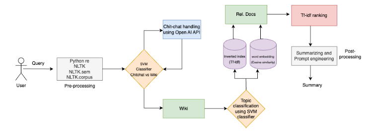

# Wikipedia RAG Chatbot

A sophisticated Retrieval-Augmented Generation (RAG) chatbot that combines web scraping, intelligent indexing, and natural language processing to provide accurate, context-aware responses from Wikipedia articles.



## Features

- **Intelligent Document Retrieval**: Indexes and searches through 60,000+ Wikipedia documents
- **Advanced Text Processing**: 
  - TF-IDF scoring for document relevance
  - Cosine similarity for semantic search
  - Sentence Transformers for document embedding
- **Multi-Topic Support**: Handles queries across various domains including:
  - Health
  - Education
  - Technology
  - Sports
  - Politics
  - Entertainment
  - And more...
- **Interactive UI**: Clean Streamlit interface with chat history and analytics
- **Real-time Analytics**: Track query patterns and topic distribution

## Architecture

The system follows a multi-stage pipeline:

1. **Document Processing**
   - Web scraping Wikipedia articles
   - Text preprocessing and tokenization
   - Document embedding using Sentence Transformers

2. **Indexing & Retrieval**
   - TF-IDF indexing
   - Skip pointer optimization
   - Cosine similarity ranking

3. **Query Processing**
   - Topic classification
   - Context-aware retrieval
   - Response generation using OpenAI GPT API

## Implementation Details

### Core Components

- **Preprocessor**: Handles text cleaning and tokenization
- **Indexer**: Manages document indexing with TF-IDF scoring
- **Topic Classifier**: Categorizes queries into relevant domains
- **Document Searcher**: Implements cosine similarity search
- **Query Handler**: Orchestrates the retrieval and response generation

### Technologies Used

- Python 3.8+
- OpenAI GPT API
- Sentence Transformers
- Streamlit
- NLTK
- scikit-learn
- Google Cloud Platform

## Screenshots


*Chat Interface with Multi-topic Support*


*Analytics Dashboard*


## Project Structure
```
wikipedia-rag-chatbot/
├── Chat.py                    # Main Streamlit interface
├── Summarizer.py             # Document summarization
├── classifier.py             # Topic classification
├── cosine_similarity.py      # Similarity search
├── general_conv.py           # General conversation handler
├── indexer.py               # Document indexing
├── linkedlist.py            # Skip list implementation
├── preprocessor.py          # Text preprocessing
└── pages/
    └── analytics.py         # Analytics dashboard
```

## Deployment

The project is deployed on Google Cloud Platform, ensuring scalability and reliable performance. The deployment process includes:

1. Container orchestration
2. Load balancing
3. Automated scaling
4. Monitoring and logging


